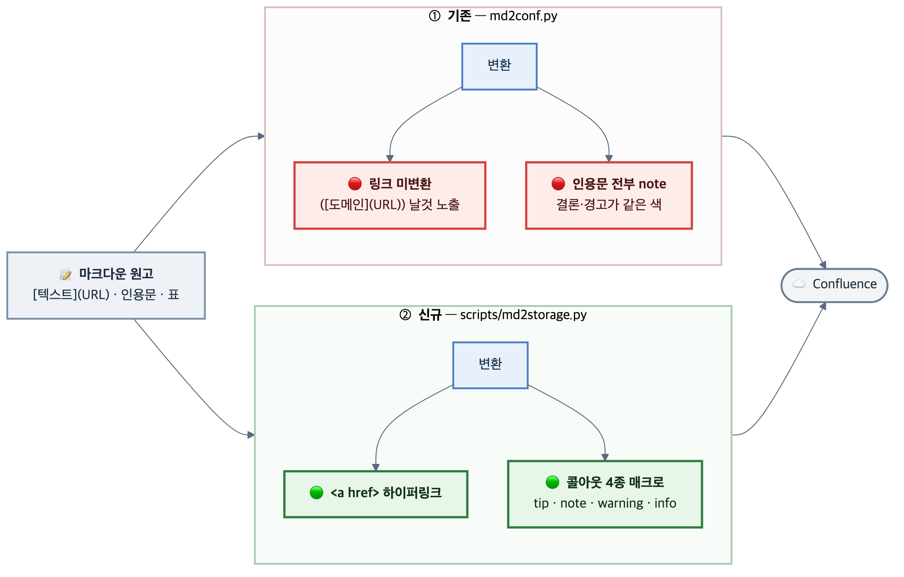

# ADR-001. Confluence 게시 변환기를 자체 구현으로 분리한다

**Bongvis 가 Confluence 에 문서를 올릴 때 쓰는 마크다운 → storage 변환기를 무엇으로 할지 정한 기록이다.**

> ✅ **결론 — 기존 `md2conf.py` 를 고치지 않고, Bongvis 전용 변환기 `scripts/md2storage.py` 를 따로 둔다.**
> 기존 변환기는 **다른 프로젝트의 소유물**이고 이미 여러 문서가 그것으로 게시돼 있다. 고치면 그 문서들의 렌더가 함께 바뀐다.

| 📌 **상태** | ✅ **채택** — 2026-09-12 적용, 문서 2건 게시로 검증 |
|---|---|
| 🎯 **정하는 것** | 마크다운 → Confluence storage 변환을 어느 코드로 수행하는가 |
| 📦 **영향 범위** | Bongvis 가 게시하는 문서. 기존 변환기를 쓰는 문서는 영향 없음 |
| 🔢 **번호 체계** | ADR-001 — **잠정**. 이 저장소에 결정 대장이 아직 없어 임시로 매겼다 |

---

## 1. 맥락 — 무엇을 정해야 했나

게시한 문서에서 출처가 `([thedroidsonroids.com](https://...))` 형태로 **날것 그대로 노출**됐다. 가독성 채점에서 감점의 주원인이었다.

원인을 따라가니 기존 변환기가 마크다운 인라인 링크를 처리하지 않았다. 같은 변환기에서 두 가지가 더 드러났다.

| 증상 | 원인 |
|---|---|
| 링크가 날것으로 노출 | `[텍스트](URL)` 변환 규칙이 없다 |
| 결론·경고·참고가 모두 같은 색 | 인용문을 전부 `note` 매크로 하나로 처리한다 |
| 표 위에 빈 회색 띠 | 헤더가 빈 표에서도 `<th>` 행을 생성한다 |

> ⚠️ **제약 — 이 변환기는 우리 것이 아니다.**
> `md2conf.py` 는 게시 대상 프로젝트의 파일이고, 이미 다수 문서가 그것으로 게시돼 있다. 동작을 바꾸면 **우리가 쓰지 않은 문서까지 렌더가 달라진다.**

---

## 2. 검토한 대안

| 대안 | 링크 해결 | 기존 문서 영향 | 판정 · 사유 |
|---|---|---|---|
| **자체 변환기를 따로 둔다** | ✅ | ✅ 없음 | ✅ **채택** — 기존 동작을 건드리지 않고 필요한 기능을 얻는다 |
| 기존 `md2conf.py` 를 수정한다 | ✅ | ❌ **전체 문서에 파급** | ❌ 탈락 — 남의 프로젝트 자산이고, 회귀를 검증할 방법이 없다 |
| 마크다운을 버리고 storage 를 직접 쓴다 | ✅ | ✅ 없음 | ❌ 탈락 — 원고가 XHTML 이 되면 사람이 못 고친다. HTML 산출물과 소스가 갈라진다 |
| 게시 후 Confluence 편집기에서 손본다 | ⚠️ 수동 | ✅ 없음 | ❌ 탈락 — 개정할 때마다 반복된다. 자동화의 목적에 반한다 |

---

## 3. 결정

`scripts/md2storage.py` 를 Bongvis 저장소에 두고, Bongvis 가 게시할 때는 이것으로 storage XHTML 을 만들어 `--storage` 로 올린다. 기존 `md2conf.py` 는 **읽기만 하고 수정하지 않는다.**

두 변환기가 공존하되 **호출하는 쪽이 다르다** — 기존 문서는 기존 경로로, Bongvis 문서는 새 경로로 간다.

---

## 4. 왜 그것인가

| 근거 | 내용 |
|---|---|
| **소유권** | 남의 프로젝트 파일을 고치면 그 파일에 의존하는 문서 전부가 내 변경의 영향을 받는다. 회귀를 확인할 책임도 범위도 우리에게 없다 |
| **가역성** | 자체 변환기는 안 쓰면 그만이다. 기존 파일 수정은 되돌리려면 다시 수정해야 한다 |
| **필요 기능의 범위** | 링크·콜아웃·빈 헤더 세 가지는 작은 수정이 아니라 **변환 규칙 자체의 차이**다. 패치로 얹기보다 따로 두는 편이 깔끔하다 |
| **검증 가능성** | 자체 변환기는 게시 전 XHTML 파싱 검증을 우리 절차에 넣을 수 있다 |

---

## 5. 이 결정으로 치르는 대가

| 대가 | 무게 | 내용 |
|---|---|---|
| **변환기가 둘이 된다** | 🟡 중간 | 같은 마크다운이 경로에 따라 다르게 렌더될 수 있다. 어느 경로로 올렸는지 추적해야 한다 |
| 기존 변환기 개선의 혜택을 못 받는다 | 🟢 낮음 | 기존 쪽이 개선돼도 자동으로 따라오지 않는다. 다만 현재 활발히 개선되는 파일이 아니다 |
| 유지보수 대상 증가 | 🟡 중간 | Confluence storage 규격이 바뀌면 우리 쪽도 고쳐야 한다 |

---

## 6. 확인하지 못한 것

| 항목 | 왜 확인 못 했나 | 영향 |
|---|---|---|
| **Confluence 매크로 호환 범위** | 사용한 4종(`tip`·`note`·`warning`·`info`)만 검증했다. 다른 매크로는 시도하지 않았다 | 🟡 중간 — 새 매크로가 필요해지면 그때 확인해야 한다 |
| **표 병합·중첩 목록** | 이번 문서 2건에 해당 구조가 없었다 | 🟡 중간 — 복잡한 표를 쓰면 먼저 시험 게시가 필요하다 |
| 두 변환기의 출력 차이 전수 비교 | 같은 원고를 양쪽으로 변환해 대조하지 않았다 | 🟢 낮음 — 경로가 분리돼 있어 섞일 일이 적다 |

---

## 근거 자료

이 결정은 외부 자료가 아니라 **Bongvis 저장소의 코드와 실제 게시 결과**에 근거한다. 아래는 저장소 내 경로다.

| 자료 | 경로 |
|---|---|
| 채택한 변환기 | `scripts/md2storage.py` |
| 기존 변환기 (수정하지 않음) | 게시 대상 프로젝트의 `confluence/md2conf.py` |
| 실무 규칙 5장 — 출처는 하이퍼링크로 | `bongvis/HOUSE-STYLE.md` |
| 규칙 개정 이력 `hs-r5` | `.bongvis/training.json` |
| 검증에 쓰인 게시본 | Confluence 페이지 318767106 · 318668804 |
