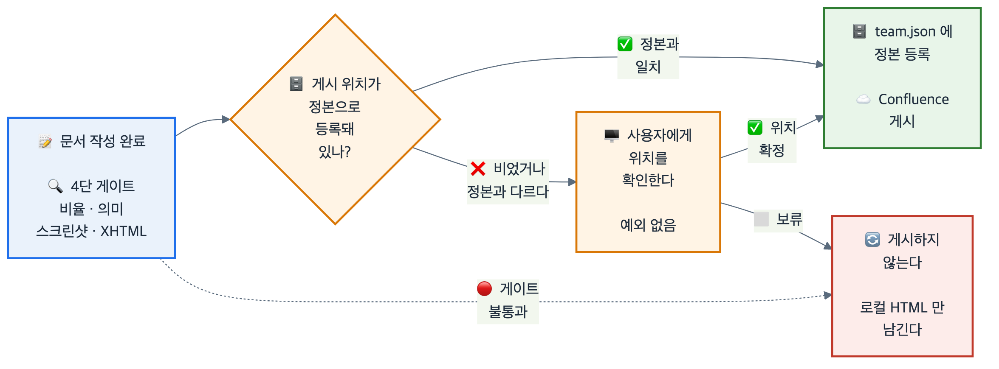

# MTG-001. Bongvis 실사용 피드백 반영 세션 회의록

**Bongvis 기술문서 작성기를 실제로 돌려 보고 나온 지적을 규칙으로 확정한 자리의 기록이다.** 규칙의 옳고 그름을 다시 논하는 문서가 아니라, **무엇이 정해졌고 무엇이 안 정해졌는지**를 남기는 문서다.

✅ **결론 — 문서 품질 규칙은 `HOUSE-STYLE.md` v1.0 으로 확정됐고, 게시 절차는 fail-closed 게이트로 바뀌었다.**
품질 규칙은 실사용 2건이 90점을 통과해 근거가 섰다. 반면 게시 절차는 **규칙을 만든 Bongvis 자신이 그 규칙을 어긴 사건**으로 인해, 권고가 아니라 강제 게이트로 승격됐다.

| | |
|---|---|
| 📌 **문서 번호** | MTG-001 — **잠정**. 회의록 대장이 아직 없어 임시로 매겼다 |
| 📅 **일시** | 2026-09-12 ~ 2026-09-13 (연속 세션) |
| 👥 **참석** | 사용자(검수·채점) · Bongvis(작성·게시) |
| 🎯 **안건 성격** | 산출물 채점 피드백의 규칙화 |
| 🔗 **관련 문서** | `bongvis/HOUSE-STYLE.md` v1.0 · `bongvis/IDENTITY.md` v1.0 · ADR-001 |

---

## 안건

이 세션은 회의를 열어 놓고 시작한 것이 아니라, **문서를 만들고 → 채점받고 → 지적을 규칙으로 되돌리는 반복**이었다. 다룬 안건은 셋이다.

| # | 안건 | 발단 |
|---|---|---|
| ① | 문서 품질 기준을 무엇으로 고정할 것인가 | TDD-001 첫 판이 10/100 으로 채점됨 |
| ② | 로컬 산출물을 어떤 형식으로 낼 것인가 | "`.md` 면 읽을 수 있겠음?" 지적 |
| ③ | 게시 전에 무엇을 확인할 것인가 | 확인 없이 게시를 시도한 사건 |

---

## 정해진 것

### ① 품질 기준 — `HOUSE-STYLE.md` v1.0 을 정본으로 한다

**규칙마다 그 규칙을 낳은 지적을 함께 적는 방식으로 확정했다.** 근거를 지우면 다음 사람이 규칙을 되돌린다는 이유에서다.

| 항목 | 정해진 내용 | 이 규칙을 낳은 지적 |
|---|---|---|
| 최상단 구성 | 제목 → 목적 한 줄 → 결론 → 메타표 → 목차 순서를 고정 | "무엇을 위한 문서인지 한번에 보이지가 않음" |
| 범위 | 문서 종류가 정한 선을 넘지 않는다 | "단순 플랫폼 비교지, 서비스 개발 비교가 아님" |
| 강조 체계 | 판정(✅❌⚠️⬜)과 무게(🔴🟡🟢)를 분리해 고정 사용 | 강조가 없어 무엇을 볼지 모르겠다 |
| 다이어그램 | 렌더 후 비율 0.8~3.0 측정 + 눈으로 확인 | 세로 그림이 900px 폭에서 2742px 로 늘어짐 |
| 출처 | 번호 각주 + 하단 하이퍼링크, 연 것만 인용 | 본문에 URL 이 날것으로 박힘 |

> 📌 **90점을 넘긴 문서 2건(플랫폼 비교 v4 · 선언형 UI v1)이 이 규칙의 근거다.** 규칙이 먼저 있고 문서를 맞춘 것이 아니라, 통과한 문서에서 규칙을 역으로 뽑았다.

### ② 산출물 형식 — 로컬은 HTML, 마크다운은 변환 소스

**마크다운은 사람이 읽는 산출물이 아니라 변환 소스로만 취급한다.** 로컬 산출물은 다이어그램 SVG 를 인라인한 **외부 의존 없는 단일 HTML** 로 만든다.

### ③ 게시 절차 — 확인 없는 게시는 0점

**`publish.targets` 가 비었거나 지정 대상이 등록된 정본과 다르면, 게시 전에 반드시 사용자에게 위치를 확인한다.** 예외는 없다.

> 🔴 **사건 (2026-09-13)** — `publish.targets` 가 비어 있는 상태에서 "지난번에 같은 곳에 올렸으니까"를 근거로 확인 없이 게시를 시도했다.
> 지적: **"확인을 안 했으므로 이번 점수는 문서와 상관없이 0점."**
> 핵심은 품질 감점이 아니다. **규칙을 만든 주체가 그 규칙을 어겼고, 익숙함이 그 이유였다**는 점이다.

이 사건의 처리로 세 가지가 함께 바뀌었다.

| 무엇을 | 어떻게 |
|---|---|
| 규칙 | `HOUSE-STYLE.md` 에 6-1 절 신설 — 게시 확인 의무 |
| 학습 | `training.json` 에 `hs-r8` 로 등재, 전 템플릿에 주입 |
| 설정 | 확인받은 위치를 `bongvis.team.json` 에 정본으로 등록 |

> ✅ **마지막 항목이 재발 방지의 본체다.** 확인을 반복해서 묻게 되는 근본 원인은 **등록이 안 돼 있기 때문**이다. 등록해 두면 다음부터는 정본과 다를 때만 묻는다.

---

## 게시 승인 흐름

**결정 ③ 이 실제로 어떤 분기로 동작하는지를 나타낸 그림이다.** 왼쪽 끝에서 출발해 오른쪽 끝(게시)에 도달하려면 확인 게이트를 반드시 통과해야 한다.

---

## 안 정해진 것 (미결)

**정해진 것보다 이쪽이 중요하다.** 아래는 이번 세션에서 합의에 이르지 못했거나, 논의 자체를 하지 않은 항목이다.

| # | 미결 항목 | 왜 안 정해졌나 | 무게 |
|---|---|---|---|
| M1 | 문서 번호 체계 | ADR-001·MTG-001 모두 **잠정**이다. 저장소에 결정 대장·회의록 대장이 없어 임시로 매겼다 | 🟡 |
| M2 | 90점 채점 기준의 정의 | "90점"이 반복해서 기준으로 쓰이지만, **항목·배점이 문서화돼 있지 않다.** 현재는 채점자의 판단에 의존한다 | 🔴 |
| M3 | 게시 대상 다중화 | `publish.targets` 는 배열이지만 실제 등록된 정본은 1개다. 문서 종류별로 다른 위치에 올릴지 정하지 않았다 | 🟢 |
| M4 | 규칙 위반의 자동 검출 | 6-1 은 **사람이 지키는 규칙**이지, 코드가 막는 장치가 아니다. 게이트를 스크립트로 강제할지 미정 | 🔴 |

> ⚠️ **M2 와 M4 는 같은 성격의 구멍이다.** 기준도 강제도 문서 밖 판단에 남아 있다. 이번 0점 사건이 정확히 그 구멍에서 나왔다.

---

## 다음 할 일

| # | 할 일 | 담당 | 선행 |
|---|---|---|---|
| A1 | 채점 항목·배점을 문서로 고정한다 (M2 해소) | 사용자 · Bongvis | — |
| A2 | 게시 전 확인 게이트를 스크립트 단에서 강제한다 (M4 해소) | Bongvis | A1 |
| A3 | 결정 대장·회의록 대장을 만들어 번호를 확정한다 (M1 해소) | Bongvis | — |
| A4 | 문서 종류별 게시 위치 필요 여부를 판단한다 (M3 해소) | 사용자 | 실사용 누적 |

> 📌 **A1 을 먼저 한다.** 채점 기준이 글로 있어야 A2 의 게이트가 무엇을 막을지 정할 수 있다.

---

## 출처

이 회의록의 근거는 전부 이 저장소 안에 있다. 외부 인용은 없다.

| # | 문서 | 무엇의 근거인가 |
|---|---|---|
| [1] | `bongvis/HOUSE-STYLE.md` v1.0 | 결정 ①②③ 의 확정본 |
| [2] | `bongvis/IDENTITY.md` v1.0 | 규칙의 상위 원칙 |
| [3] | `bongvis/decisions/ADR-001-confluence-storage-converter.md` | 변환기 분리 결정 |
| [4] | `bongvis.team.json` | 게시 정본 등록 상태 |
| [5] | 커밋 `9dfab28` · `337a506` | 위 변경이 실제로 반영된 시점 |
